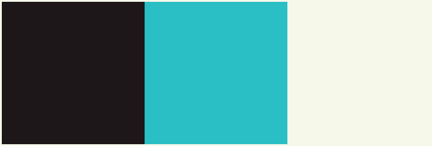

    
    
    

    
This is the official branding for the GoUp! project.

## Fonts

For both of the logos, [Poppins](https://fonts.google.com/specimen/Poppins) is used. It's a sans-serif font, and it's available on Google Fonts.

## Colors

The color palette:

This includes the following colors:

- #1D1719 (Licorice)
- #2ABFC4 (Robin egg blue)
- #F6F8EA (Ivory)
